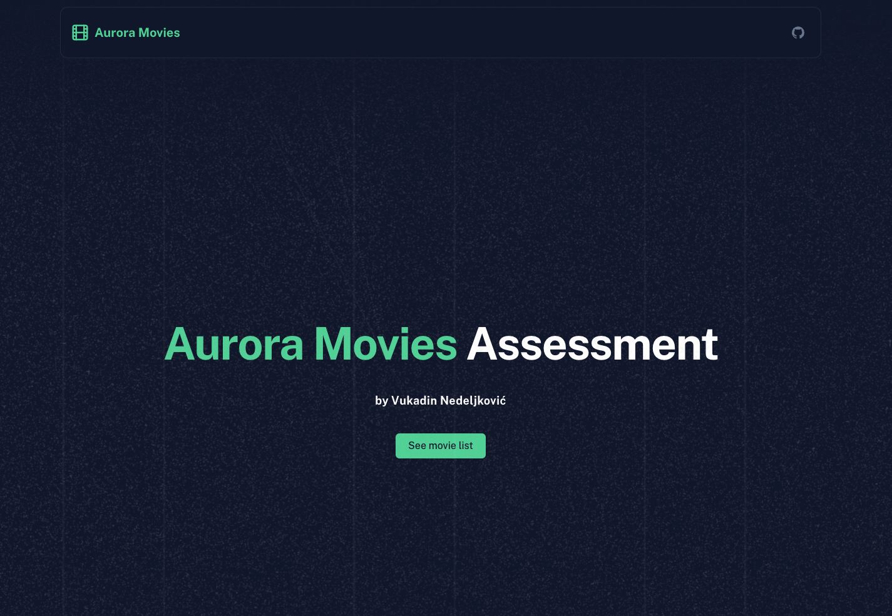

# Aurora Movies Assesment



# Live Preview

[Github Page](https://vukadinfe.github.io/aurora-assessment/)

[Vercel](https://aurora-assessment.vercel.app/)

NOTE: Communication in live preview will not work since both Github Pages and Vercel are HTTPS.

See [Bug Report](#bug-report)

Please [run the application locally](#development-server) for full experience.

# Bug Report

The API endpoint returns a 307 Temporary Redirect that downgrades the connection from HTTPS to HTTP (URL in Location Response Header), causing a mixed content error when accessed from secure origins. This bug needs to be resolved by ensuring the redirect preserves the HTTPS protocol.

## Setup

Add environment variables:

```bas
.env
NUXT_PUBLIC_API_BASE=https://november7-730026606190.europe-west1.run.app/
```

Make sure to install the dependencies:

```bash
# npm
npm install

# pnpm
pnpm install

# yarn
yarn install

# bun
bun install
```

## Development Server

Start the development server on `http://localhost:3000`:

```bash
# npm
npm run dev

# pnpm
pnpm run dev

# yarn
yarn dev

# bun
bun run dev
```

## Production

Build the application for production:

```bash
# npm
npm run build

# pnpm
pnpm run build

# yarn
yarn build

# bun
bun run build
```

Locally preview production build:

```bash
# npm
npm run preview

# pnpm
pnpm run preview

# yarn
yarn preview

# bun
bun run preview
```

Check out the [deployment documentation](https://nuxt.com/docs/getting-started/deployment) for more information.
